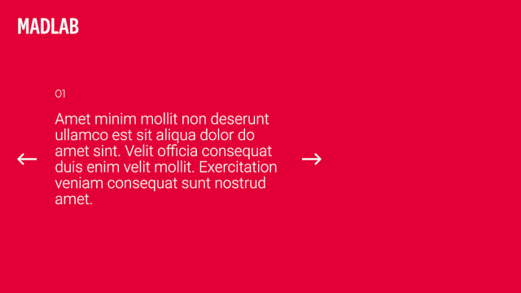

# Desafio - Back-end

## O Desafio

[Figma](https://www.figma.com/file/TFEljOPck192pX1sgPDmFh/Teste-Front)

O desafio consiste em desenvolver uma API em um prazo determinado.

## Funcionalidades

- A aplicação deve seguir rigorosamente a viabilização do conteúdo ilustrado no [Figma](https://www.figma.com/file/TFEljOPck192pX1sgPDmFh/Teste-Front)
- A aplicação deve considerar o conteúdo do carousel na primeira seção da página
- A aplicação deve considerar o conteúdo do mosaico na segunda seção da página

## Requisitos

- Comunicação com a API através de XHR
- É permitido o uso de frameworks, ou bibliotecas desde especificado na entrega
- Todo o funcionamente deve ser especificado de forma que seja possivel testa-lo

## Instruções do desafio

1. Crie uma branch com seu nome **(Ex. nome_sobrenome)**
2. Desenvolva
3. Crie uma merge request

## O que será avaliado?

- Funcionamento
- Clareza do código
- Manutenabilidade
- Histórico de commits
- Documentação da entrega
- Boas práticas

## Links úteis

[Figma](https://www.figma.com/file/TFEljOPck192pX1sgPDmFh/Teste-Front)

## FAQ

**Qual é o prazo para entrega do desafio?**

O prazo é definido através da entrevista ou do email contendo o desafio.

**Figma não permite inspecionar os elementos?**

O Figma só permite que usuários logados possam inspecionar elementos, neste caso talvez seja necessário criar uma conta ou logar com alguma já existente.

